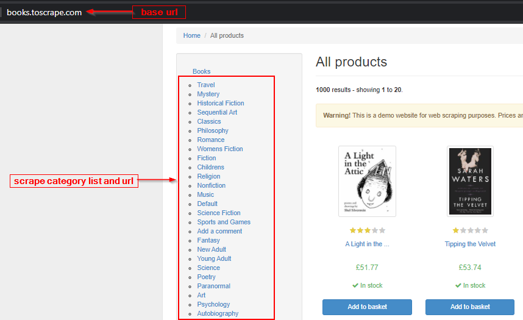
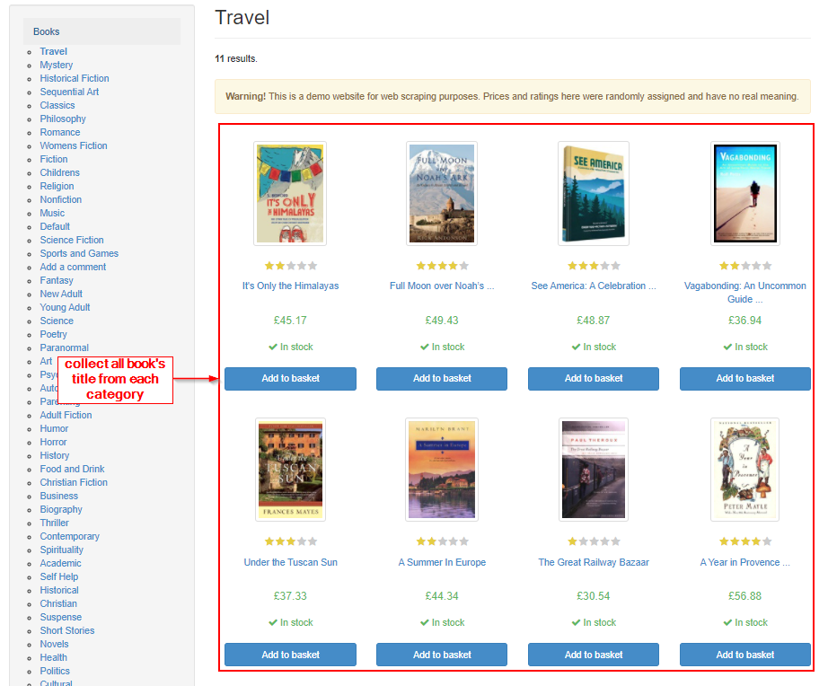
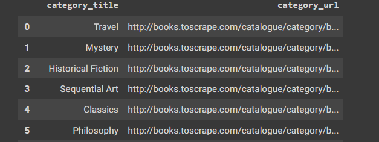

## Dataset of Books

scrape category:
- 

collect data from each category:
- 

Therefore, function created for collecting all data.

Lastly, I save the data as a csv format via using dataframe.

here, show a dataframe sample:
- 