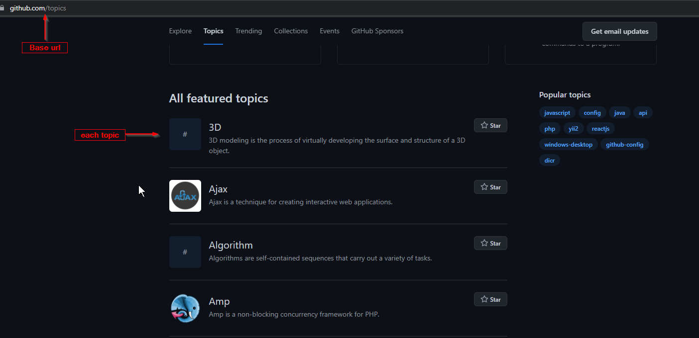
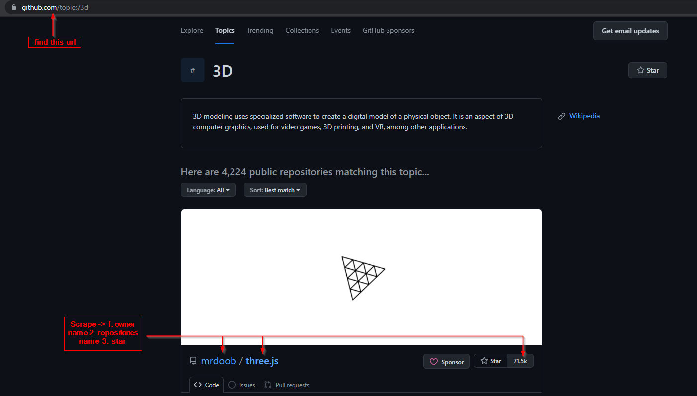
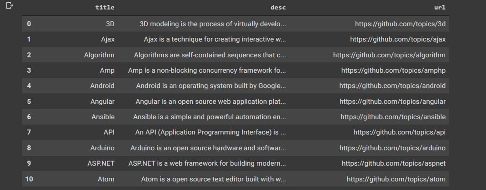

## Top Repo From Github Topics

In this project, I try to figure out top repo of few featured topics from [Github](https://github.com/topics)
- 

then from each topic , i try to scrape owner name, repo name and stars of few top repositories .
- 

After that, I save the data as a csv format via using dataframe.

here, show a dataframe sample:
- 