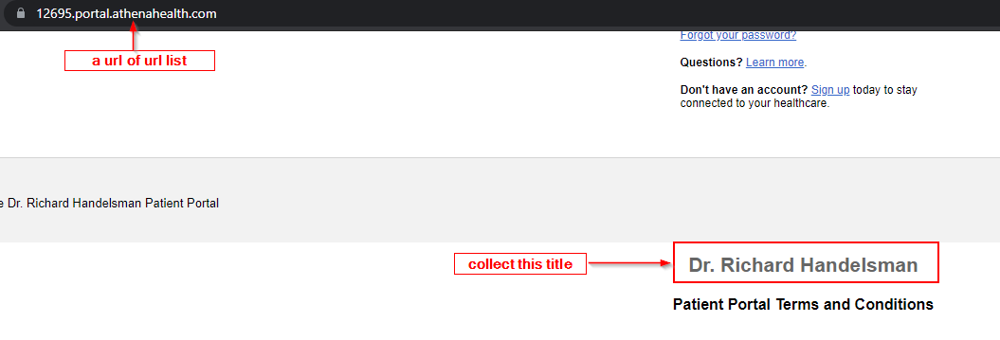
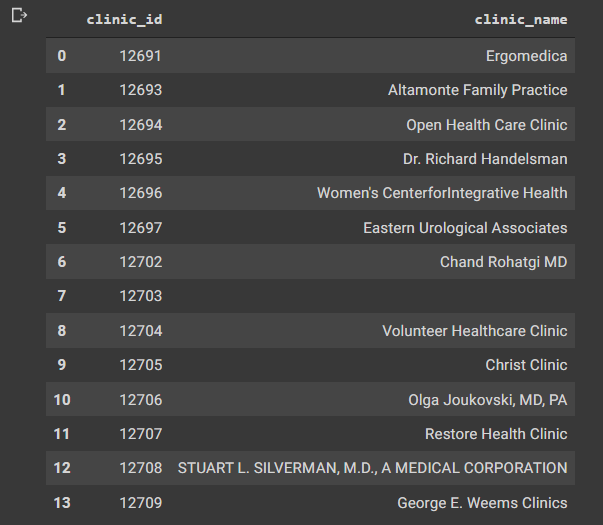

## title collection from url list

change the url number and scrape data:
- 

Therefore, function created for collecting all data.

Lastly, save the data as a csv format via using dataframe.

here, show a dataframe sample:
- 